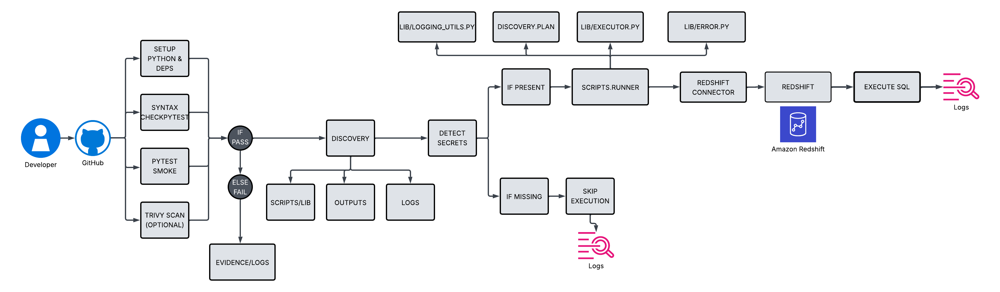

# Allwyn Assignment — Redshift SQL deploy via GitHub Actions

Implements the assignment with **manual workflow trigger**, **Redshift password auth**, and **enhanced safety + evidence features**.
This approach aligns with DevOps best practices: modular pipelines, immutable evidence artifacts, and automated rollback for safer database releases.

## Table of Contents
- [Dear Team](#dear-team)
- [What the assignment asked](#what-the-assignment-asked)
- [What this repo delivers](#what-this-repo-delivers)
- [Promotion Flow](#promotion-flow)
- [Why a combination of YAML and Python scripts instead of only YAML?](#why-a-combination-of-yaml-and-python-scripts-instead-of-only-yaml)
- [Future Expansion and Modularity](#future-expansion-and-modularity)
- [Limitations / Known Issues](#limitations--known-issues)
- [Repository Structure](#repository-structure)
- [Architecture Diagram](#architecture-diagram)
- [Redshift SQL Deploy – GitHub Actions](#redshift-sql-deploy--github-actions)
  - [1. Context](#1-context)
  - [2. Repository Structure](#2-repository-structure)
  - [3. Conventions](#3-conventions)
  - [4. Configuration](#4-configuration)
  - [5. Runbook – Redshift SQL Deploy via GitHub Actions](#5-runbook--redshift-sql-deploy-via-github-actions)
    - [Purpose](#purpose)
    - [Pre-Requisites](#pre-requisites)
    - [Inputs](#inputs)
    - [Security & Compliance](#security--compliance)
    - [How to Run](#how-to-run)
      - [When credentials are not available](#when-credentials-are-not-available)
      - [Logs and Evidence](#logs-and-evidence)
    - [Screenshots](#screenshots)
    - [Outputs](#outputs)
    - [Rollback](#rollback)
    - [Troubleshooting](#troubleshooting)
- [Ownership and Escalation](#ownership-and-escalation)


## Dear Team,

Please find attached my updated implementation of the **BI Cloud Integration & Release Specialist assignment**.

Key highlights:

- GitHub Actions workflow with **manual trigger** (`workflow_dispatch`).
- Inputs: `branch`, `sql_path`, and optional `execution_order`.
- SQL scripts are auto-discovered and executed in the correct order.
- Batch friendly- Drop in 50 SQL files → runner auto-discovers and executes them.
- Automatic rollback (autocommit=false).
- **Batch transaction:** all SQL files run in one transaction → commit if all succeed, rollback if any fails.
- **Parameterisation:** SQL can use `{{VAR}}` placeholders, replaced by environment variables (e.g. `SCHEMA_NAME`).
- **Policy guardrails:** in `prod`, destructive commands (`DROP`, `TRUNCATE`) are blocked unless explicitly allowed.
- Evidence v2 (evidence.json) includes run id, start/finish timestamps, environment summary, per-file timings, row counts, and error messages.
- The Redshift execution step runs only when Redshift connection secrets are configured in GitHub.
- Modularized design: one YAML workflow plus Python helper scripts (`scripts/`) for discovery, execution, policies, and evidence logging.

To enable full execution, simply configure the following GitHub Secrets in the repo:

- `REDSHIFT_HOST`
- `REDSHIFT_PORT`
- `REDSHIFT_DB`
- `REDSHIFT_USER`
- `REDSHIFT_PASSWORD`

Optional GitHub Variables:

- `ENVIRONMENT` (e.g. dev, test, prod)  
- `SCHEMA_NAME` (for parameterised SQL)  
- `ALLOW_DESTRUCTIVE` (set to true in prod only with CAB approval)

The pipeline is demo-ready — it already passes syntax, lint, and discovery checks without credentials. With the above secrets in place, it will execute the SQLs directly against Redshift.

Best regards,

**Ashish Dev**

## What the assignment asked

- A GitHub Actions pipeline triggered manually.
- Inputs for branch, SQL path, and execution order.
- Execute SQL scripts against AWS Redshift using username/password.
- Upload logs/evidence as artifacts.

## What this repo delivers

- **Workflow:** `.github/workflows/deployment.yml`
    - Handles inputs and triggers.
    - Runs Python setup, syntax check, pytest smoke, discovery, and upload.
    - Executes SQL only if secrets are present.
- **SQLs:** Minimal demo scripts under `/sql` (`create schema`, `create table`, `insert rows`).
- **Evidence v2:** Every run generates `artifacts/run-YYYYmmdd-HHMMSS/summary.json` plus per-file logs. Evidence includes run id, timestamps, env summary, statements count, row counts, elapsed time, success/failure.
- **Python scripts (`/scripts`):**
    - `runner.py` → orchestrator with batch commit/rollback.
    - `lib/discovery.py` → finds files, enforces order.
    - `lib/executor.py` → connects to Redshift, runs SQL, applies parameterisation & guardrails.
    - `lib/logging_utils.py` → writes structured evidence v2.
    - `lib/errors.py` → clean exceptions.
- **Extras:** Optional Trivy scan script for good practice (security gate).

## Promotion Flow

```text
feature/* → PR → main (Dev) → release/* (Test) → tag v* (Prod)  
                |               |                    |  
        discovery ok     approval required     approval + Evidence

```  

## Why a combination of YAML and Python scripts instead of only YAML?

This could have been done with a single long YAML file that calls psql directly. 
I chose to split it into Python scripts plus a short YAML workflow because that’s an effective way to build release pipelines.


# Future Expansion and Modularity

This design (YAML for orchestration + Python for logic) is modular and can be expanded easily.  

Some future use cases and benefits:

- **Support for multiple databases**  
  Add new executors for Postgres, Snowflake, BigQuery, etc. without touching the YAML workflow.  

- **Advanced validation**  
  Extend Python scripts to run schema checks, data quality rules, or linting before execution.  

- **Config-driven runs**  
  Introduce a manifest file to define execution order, environments, and rollback scripts centrally.  

- **Selective deployments**  
  Deploy only changed SQL files based on Git diffs, reducing runtime and risk.  

- **Rollback packs**  
  Bundle pre-written rollback SQLs that can be triggered automatically.  

- **Improved evidence**  
  At present, every run generates an `artifacts/run-<timestamp>/evidence.json` plus console logs.  
  These are uploaded as GitHub Actions artifacts with retention settings, so evidence can be downloaded for audit.  

- **Integration with release gates**  
  Add checks for approvals, CAB, or change tickets before running in production.  

- **Testing hooks**  
  Run unit or integration tests automatically after SQL execution.  

- **Scalability**  
  As the logic grows, scripts remain modular and easy to test, while the pipeline YAML stays simple.
 


## Limitations / Known Issues

- Only supports Amazon Redshift at the moment.  
- No schema diffing or dependency management between SQL files.  
- No built-in data validation or quality checks beyond execution success/failure.  
- **Automatic rollback only works within a run** (if one file fails, all changes are rolled back). For planned rollbacks of already-deployed changes, separate rollback SQL files are still needed.  
- Execution is sequential only; no parallelism for independent scripts.  
- Long-running SQL statements may hold up the job.  
- Evidence (e.g. `evidence.json`, console logs) is uploaded as GitHub Actions artifacts, which are subject to GitHub’s retention settings (default ~90 days).  

## Repository Structure

- `README.md` – Runbook and documentation  
- `requirements.txt` – Python dependencies for the runner  
- `artifacts/` – Stores evidence from workflow runs (summary.json, logs)  
- `scripts/` – Python runner and helper logic  
  - `runner.py` – Entrypoint script called by the workflow (batch commit/rollback)  
  - `lib/` – Library code used by the runner  
    - `discovery.py` – Finds and orders SQL files  
    - `executor.py` – Executes SQLs against Redshift, supports env substitution & guardrails  
    - `logging_utils.py` – Writes logs and summary.json evidence v2  
    - `errors.py` – Custom exceptions  
  - `run_trivy.sh` – Example shell script to run Trivy (image scan, optional)  
- `sql/` – Ordered SQL files for deployment  
  - `001_create_schema.sql`  
  - `010_create_table.sql`  
  - `020_insert_rows.sql`  


## Architecture Diagram




# Redshift SQL Deploy – GitHub Actions

## 1. Context
This repository provides a way to run ordered SQL changes against Amazon Redshift directly from GitHub Actions.  
It supports both dry-run (discovery only) and execution (with credentials) modes, with evidence captured for every run.

## 2. Repository Structure
- `.github/workflows/` – GitHub Actions pipeline definitions  
- `scripts/` – Python runner and helper libraries  
- `sql/` – Ordered SQL files (`001_`, `010_`, …, `900_rollback`)  
- `config/` – Example manifest / configs  
- `README.md` – Documentation (this file)

## 3. Conventions
- SQL files must be prefixed with an incrementing number (`001_`, `010_`, …).  
- Rollback files should use the `900_` prefix.  
- SQL should be idempotent where possible (e.g. `CREATE IF NOT EXISTS`).  

## 4. Configuration
- Inputs: `branch`, `sql_path`, `execution_order` (optional).  
- Secrets: `REDSHIFT_HOST`, `REDSHIFT_PORT`, `REDSHIFT_DB`, `REDSHIFT_USER`, `REDSHIFT_PASSWORD`.  
- Network: GitHub runners must be able to reach the Redshift cluster.

## 5. Runbook – Redshift SQL Deploy via GitHub Actions

## Purpose

This workflow deploys ordered SQL changes into Amazon Redshift using GitHub Actions.  

It can run in two modes:

- **Discovery mode (no credentials):** lists the SQL files that would run.  
- **Execution mode (with credentials):** executes the SQL files against Redshift inside a single batch transaction.  

## Pre-Requisites

- GitHub repository with Actions enabled.  
- The following GitHub Secrets configured:  
  - `REDSHIFT_HOST`  
  - `REDSHIFT_PORT`  
  - `REDSHIFT_DB`  
  - `REDSHIFT_USER`  
  - `REDSHIFT_PASSWORD`  
- Redshift must allow network access from GitHub runners (VPC / security group).  

## Inputs

- `branch` → the Git ref to deploy from.  
- `sql_path` → a single SQL file or a folder (default: `sql/`).  
- `execution_order` (optional) → comma-separated list of filenames when running in folder mode.  

## Security & Compliance
- Credentials are injected securely via GitHub Secrets.
- No credentials are stored in code or artifacts.
- Evidence files contain only safe metadata (no secrets).
- Redshift access restricted via VPC/security groups (Hopefully).


## How to Run
1. Go to GitHub → Actions → select **Redshift SQL Deploy (manual)**.
2. Click **Run workflow** and provide branch, sql_path, and execution_order if required.
3. Monitor the logs. The workflow runs in this order:  
   Setup → Syntax check / Pytest → Discovery (always) → Execute SQL (only if credentials exist) → Upload evidence.

### When credentials are not available
- The workflow runs in **dry run mode**.  
- Only the discovery step is executed.  
- It lists the SQL files in order but does not connect to Redshift. 
    Setup → Syntax check / Pytest → Discovery (always) → Upload evidence (no SQL executed, creds not available)


### Logs and evidence

- Logs are available in the GitHub Actions job output.  
- If no credentials are set, the evidence artifact still contains:  
  - `evidence.json` showing the list of discovered SQL files and their order.  
- If credentials are set, evidence includes:  
- `run_id`, `started_at`, `finished_at`  
- `env_summary` (safe values only)  
- Per-step timings, row counts, success/failure status  

## Screenshots

The following screenshots illustrate how the workflow behaves in different scenarios.

### 1. Successful run (with credentials)
Shows a full execution where all SQL files succeed.  
The Actions log displays the **Evidence Summary** with `run_id`, files executed, timings, and row counts.  


---

### 2. Dry run (without credentials)
When secrets are not configured, the workflow runs in **discovery mode**.  
The Actions log lists the SQL files in order, but no connection is made to Redshift.  


---

### 3. Evidence artifact (`evidence.json`)
Each run produces structured evidence (`artifacts/run-<timestamp>/evidence.json`).  
This file records metadata, per-file status, timings, and rollback details.  


## Outputs

- Logs showing discovered SQL files and results.  
- Evidence artifact uploaded:  
- `redshift-evidence-<run_id>/summary.json`  
- Per-file logs if SQL was executed.  
- **Rollback is automatic within a run:** if any file fails, all changes are rolled back.  
- For planned rollbacks of previous deployments, prepare a rollback SQL (e.g. prefixed with `900_`).  

## Rollback

- **Auto rollback:** Built-in. If any SQL file fails during execution, the entire transaction is rolled back automatically (no partial changes).  
- **Planned rollback:** For already-deployed changes, prepare a rollback SQL script (e.g. `DROP`, `ALTER`) and prefix it with `900_`. Re-run the workflow with this file included.  
- **Evidence:** The generated `evidence.json` and logs confirm whether the rollback executed successfully and in what order.  
  

## Troubleshooting

- **No artifact:** check that “Prepare artifacts” and “Discovery” steps ran successfully.  
- **Import/module error:** make sure the runner is invoked as a module (already in the workflow).  
- **Connection/authentication error:** check GitHub Secrets and Redshift network access.  
- **Policy block:** destructive SQL in prod blocked unless `ALLOW_DESTRUCTIVE=true`.  


## Ownership and Escalation
- Application owner: Data/BI team-                         TBD,           Phone: 123456789, Email:abc@xxx.com
- Pipeline owner: Release Engineer-                        Ashish Dev,    Phone: 123456789, Email:def@xxx.com
- Infrastructure owner: Cloud Platform (VPC and Redshift)- TBD,           Phone: 123456789, Email:ghy@xxx.com

---

[Back to top](#allwyn-test-2--redshift-sql-deploy-via-github-actions)
